# *Rodillo´s Gaming Studio*

# GAME DESIGN DOCUMENT DE DESKTOP TOWER CHESS

# 1. INTRODUCCIÓN 
## EQUIPO DE DESARROLLO
Nuestro equipo de desarrollo, Rodillo´s Games, está compuesto por los siguientes integrantes:
+ Departamento de <b>Programación</b>: Andrés, Manuel y Javier.
+ Departamento de <b>Diseño</b>: Javier y Laura.
+ Departamento de <b>Arte 3D</b>: Daniel y Laura
+ Departamento de <b>Arte 2D/Concept</b>: Daniel.
 

## DESCRIPCIÓN
Un extraño programa ha llegado a parar a tu ordenador y te advierte de que te están hackeando. 

Siguiendo sus instrucciones y a través de una su interfaz gráfica de Tower Defense tendrás que ser capaz de protegerlo para que los hackers no roben sus datos. 
  
Mientras te enfrentas a los hackers irás descubriendo información sobre ellos y se irá mostrando la verdadera naturaleza del programa. 

Cómo uses dicho programa dependerá solamente de ti. 
 

## OBJETIVO
El objetivo de *Desktop Tower Chess* es proteger tu nuevo programa para evitar que los hackers accedan a él y roben sus datos. Para ello, podrás valerte de una serie de torres en los límites físicos del programa que atacarán a todo agente sospechoso que se acerque por la zona. Dispondrás un terreno finito y tu tarea será gestionar y desplegar las distintas torres con las que cuentes en tu inventario. Pero cuidado, si algún hacker consigue entrar, empezará a robarte información y tu código irá desapareciendo paulatinamente hasta que se adueñen de todo tu programa. <b>¡Debes impedirlo!</b>
  

## PLATAFORMAS Y REGIONES
*Desktop Tower Chess* será lanzado originalmente para dispositivos móviles y ordenadores.
  

# 2. ESTRUCTURA DEL JUEGO
## PANTALLAS
El juego dispone de las siguientes pantallas:
+ Escritorio del Sistema Operativo
+ Menú principal
+ Ajustes
+ Créditos
+ Selección de nivel
+ Pantalla de juego (*in-game*)
+ Menú de pausa 

La pantalla Escritorio del S.O. solo será accesible la primera vez que se juegue. En adelante, apareceremos siempre en el Menú Principal. 

Desde Ajustes, Créditos, Selección de nivel o el mismo juego, podemos regresar al Menú Principal (perdiendo los últimos avances de la partida en el caso de la Pantalla de Juego), y desde él podremos salir de la aplicación. 

El Menú de Pausa congelará el juego. Desde él, podremos regresar a él en el último punto o salir al Menú Principal con la consecuente pérdida del avance. 

La transición de pantallas es la que se indica en el siguiente diagrama. 

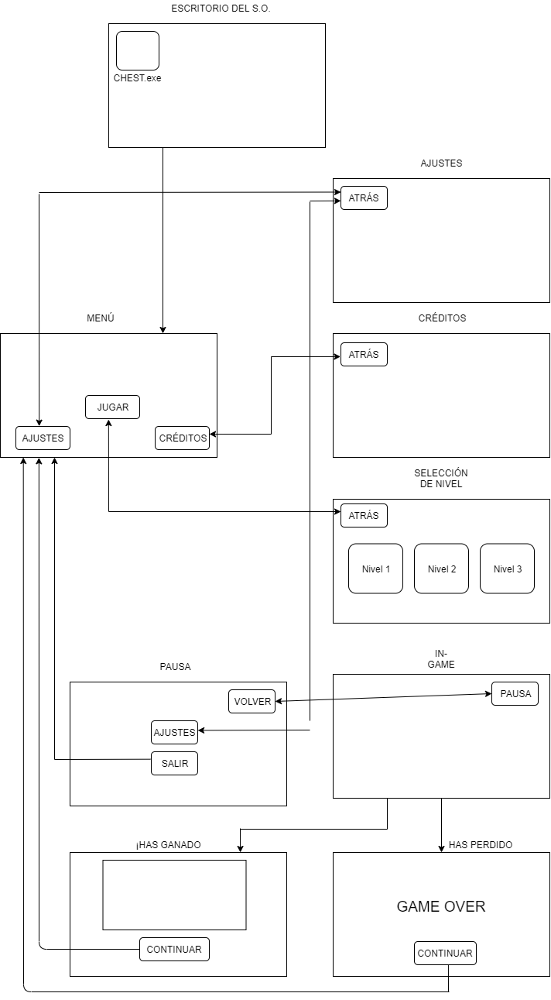
 

## MECÁNICAS DE JUEGO
*Desktop Tower Chess* es un juego estratégico, por lo que las mecánicas son bastantes simples y la experiencia de juego va a depender de la <b>gestión de las unidades en tu inventario</b>. 
Cuando vayas superando mapas, se te irán entregando nuevas y diferentes torres cuya actuación respecto a los enemigos es distinta. Algunos valores mejoran, y otros empeoran. E incluso aparecen algunos nuevos. La responsabilidad del jugador será sopesar los atributos de las torres defensivas y su efectividad contra los distintos tipos de enemigos que podrán ir apareciendo.
 

## CONTROLES

Los controles serán puramente táctiles en el caso de móviles, y mediante mouse en el caso de ordenadores.  
La transición entre pantallas se conseguirá mediante click en los botones de la interfaz. La colocación de torres en el mapa se realizará de la misma manera.

 

## TORRES

Las torres serán el elemento primordial del juego ya que el jugador tendrá que usarlas para defenderse de las hordas de enemigos que vayan llegando. Cada tipo de torre tendrá un precio o coste fijo y todas las torres tendrán unas posiciones específicas y limitadas donde se podrán colocar. Las torres siempre atacarán al objetivo más cercano.
 

## TIPOS DE TORRES

<b>Torre básica</b> 
  
- Las torres básicas disparan a un solo objetivo de manera intermitente.

- Velocidad de disparo: rápida.

- Coste: bajo.

- Daño: normal.

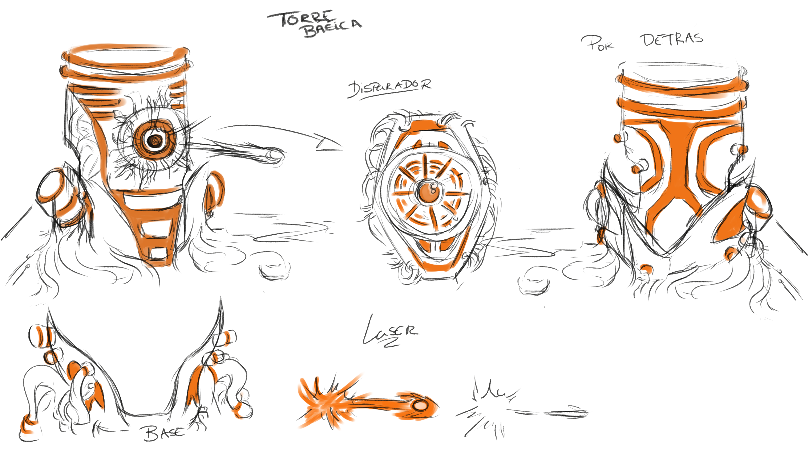

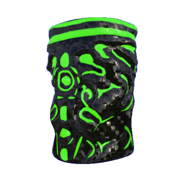

<b>Torre en área</b> 
  
- Los ataques de estas torres cubren un área en el que dañan a todos los objetivos.

- Velocidad de disparo: lenta.

- Coste: medio.

- Daño: bajo (en área).

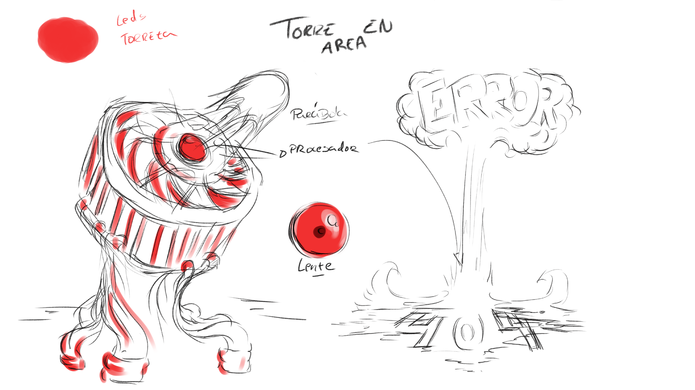

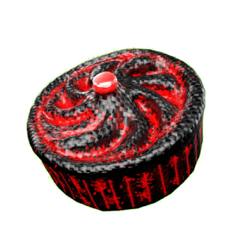

<b>Torre ralentizadora</b> 
  
- Los ataques de las torres ralentizadoras cubren un área pero no hacen daño sino que reducen la velocidad de los enemigos.
  
- Velocidad de disparo: media.

- Coste: medio.

- Daño: nulo.

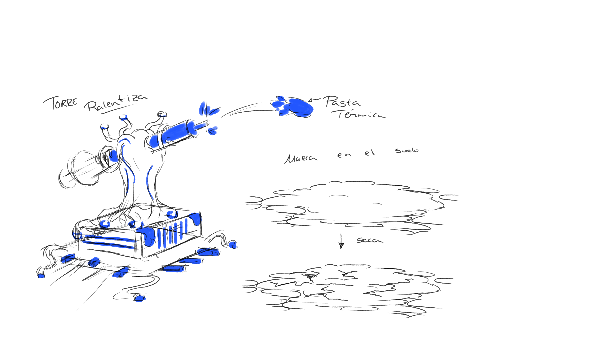

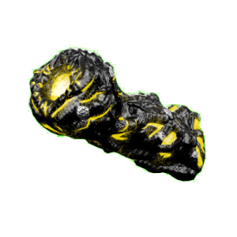

<b>Torre de rayos</b> 
  
- Esta torre dispara de manera continua y sus ataques afectan a un solo objetivo.

- Velocidad de disparo: continua.

- Coste: alto.

- Daño: alto.

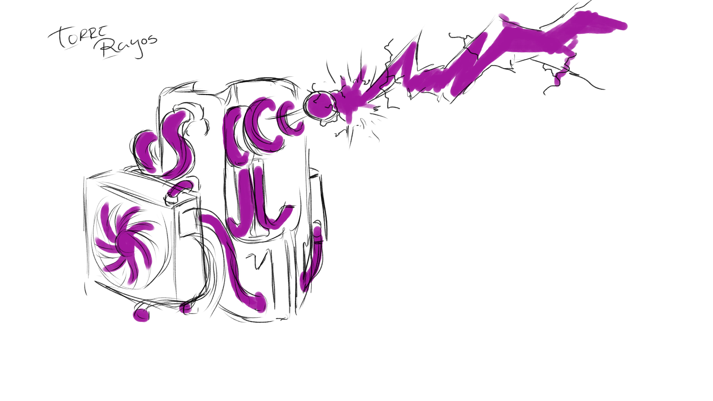

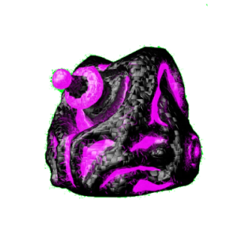

## MEJORAS PARA LAS TORRES

**Al mejorar las torres aumentan dos estadísticas:**
- Velocidad de disparo.
- Rango de la torre.

**En el caso de las torres de rayos mejoran:**
- Daño de disparo.
- Rango de la torre.

**Además todas las torres aumentan su tamaño al ser mejoradas.**
 

## ENEMIGOS
Los enemigos son los diferentes virus a los que te tendrás que enfrentar mediante las torres, dependiendo del tipo de enemigo tendrá diferentes estadísticas y así mismo si llega al core de tu programa destruirá una cantidad distinta de datos. Al destruir a un enemigo este reportará una ganancia que se podrá invertir en construir nuevas torres o mejorarlas y cuya cuantía también dependera del tipo de enemigo. 

## TIPOS DE ENEMIGOS

<b>Básico</b>

- Los enemigos más básicos, son los que cuentan con menos vida, carecen de ninguna habilidad.
- Velocidad: lenta.
- Vida: baja.
- Daño: bajo.
- Beneficio al derrotarlo: bajo.

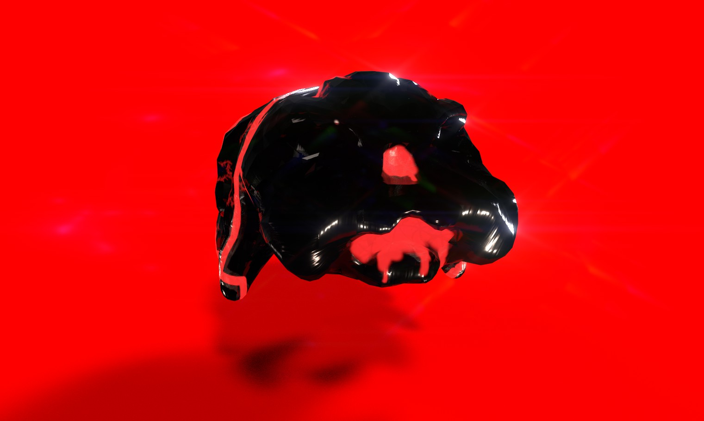

<b>Tanque</b>

- Muy similares a los enemigos básicos pero con mucha más vida.
- Velocidad: lenta.
- Vida: alta.
- Daño: alto.
- Beneficio al derrotarlo: alto.

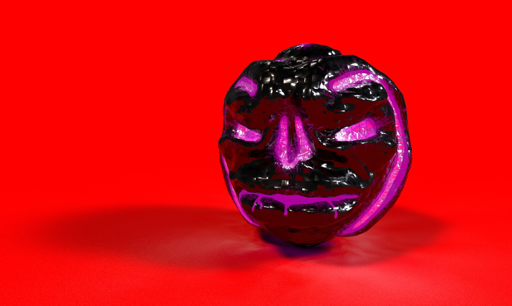

<b>Sanador</b>

- Con más vida que los enemigos básicos y con la habilidad de sanar en área, tanto a sí mismos como a otras unidades.
- Velocidad: media.
- Vida: media.
- Daño: medio.
- Beneficio al derrotarlo: alto.

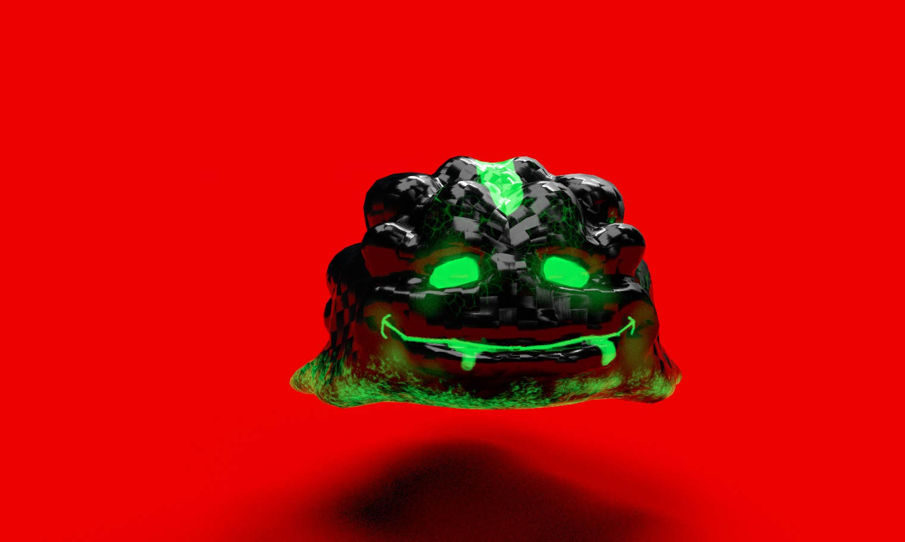

<b>Volador</b>
  
- Similares a los básicos, pero el ser voladores son inmunes a las torres ralentizadoras y a las torres en área.  
- Velocidad: media.
- Vida: baja.
- Daño: bajo.
- Beneficio al derrotarlo: medio.

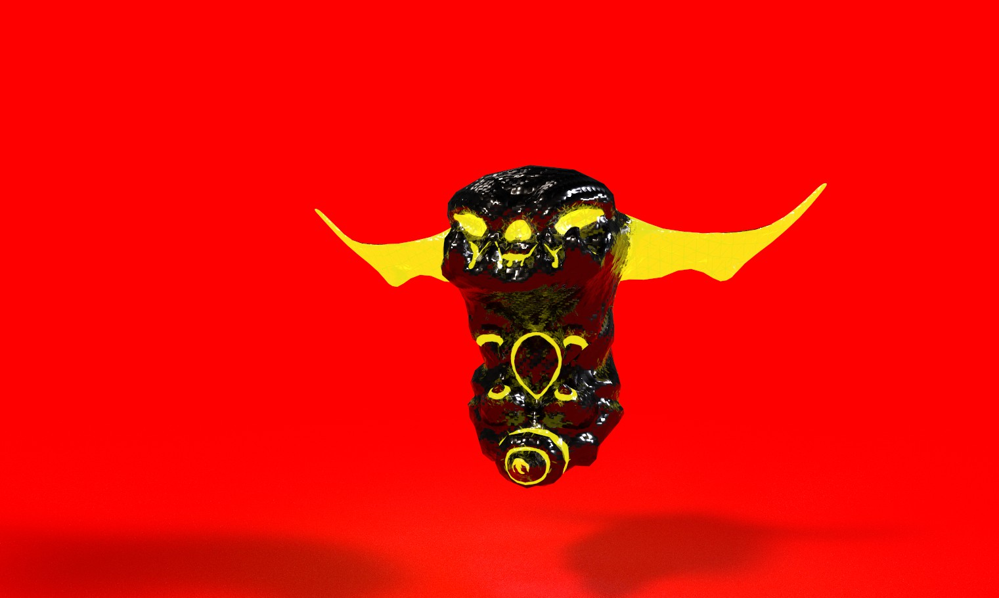

 

## MAPAS
Los mapas del juego variarán según el nivel en el que estés. Son espacios estáticos y con un recorrido pre-establecido. 
Pero cada partida será diferente, pues las combinaciones de enemigos serán aleatorias, consiguiendo que el jugador deba emplear diferentes estrategias según las circunstancias.
  

## PUNTUACIÓN
La puntuación del juego se basa por un lado en la obtención de un número de ficheros completos al final del nivel y por otro en el tiempo que se tarde en completar el nivel. 
Lo que decidirá el número de ficheros que dar al jugador dependerá de la <b>cantidad de datos restantes</b> al finalizar la partida. Si no se ha superado el nivel, nuestra puntuación será de 0 ficheros, y dependiendo del porcentaje restante, se hará una proporción en la que se asignarán 1, 2, o 3 ficheros (este último caso si nuestro programa conserva el 100% de sus datos).
 
El tiempo por otro lado dependerá de la eficiencia en la colocación de las torres de manera que los enemigos se eliminen lo más rápido posible, ya que el tiempo de eliminación de una oleada condiciona la aparición de la siguiente.
 

# 3. LOGÍSTICA
## HERRAMIENTAS DE DESARROLLO
Se trata de un videojuego en 3D, por lo que será desarrollado con el motor gráfico *Unity 3D* en su versión 2018.4 respaldado con el IDE *Microsoft Visual Studio 2019* para codificación. 
Para la etapa de Concept Art, se utilizará *Adobe Photoshop CC 2018*.
En Modelado se usará *ZBrush* y en Texturización *Substance*.
  

## MONETIZACIÓN

<b>Público Objetivo:</b> El juego irá orientado tanto a amantes de los juegos de estrategia por sus mecánicas como a personas interesadas en el mundo del hacking y la informática por su estética y argumento. Además buscará captar también al público interesado en los juegos competitivos. 

<b>Formato episódico:</b>  Cada episodio tiene un conjunto de niveles y un personaje (hacker) nuevos sobre los que vas descubriendo información. Según progresa la historia se irá revelando más información sobre el programa. 
Los episodios se irán lanzando según se vayan desarrollando, cada uno contará con 3 niveles nuevos, nuevos tipos de torres y enemigos e introducirá a un nuevo personaje, el precio de cada uno de estos episodios será 2.99€. 

Este precio es el más adecuado porque lo hace algo asequible para el cliente y nos proporcionará una audiencia asegurada en los compradores de los primeros episodios, que deseosos de continuar con la historia seguirán comprando los siguientes.

Estimamos que las horas de trabajo invertidas serán de 104 para el primer episodio (40 de programación, 45 de arte incluyendo concept, modelado y texturizado, 12 de diseño de niveles, 10 de diseño de interfaces y 5 de guión), y que cada episodio adicional llevará 28 horas (1 hora de programación, 10 de arte, 12 de diseño de niveles y 5 de guión).
 Basándonos en esta estimación podemos calcular los beneficios por hora que obtendríamos en función de las copias vendidas, como se muestra en la siguiente tabla:

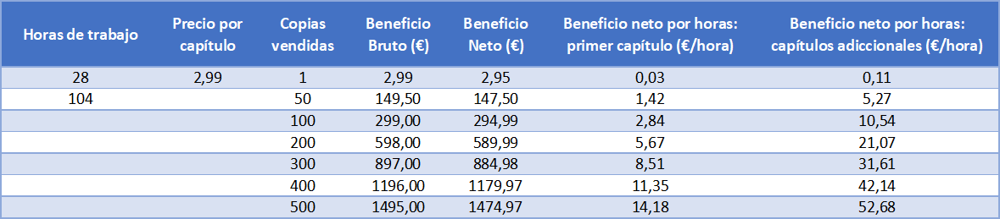 

A continuación podemos ver una gráfica que ilustra mediante tres estimaciones de ventas (pesimista, más probable y optimista) los beneficios por hora de trabajo en función de las copias vendidas, dependiendo de si se trata del primer capítulo o uno de los consecutivos:

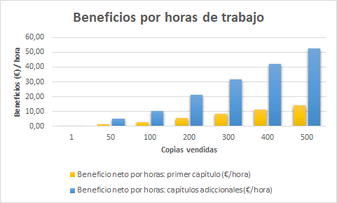 

Para obtener al menos 10€ de remuneración por cada una de nuestras horas de trabajo necesitaríamos hacer 3 episodios asumiendo que se van a vender 50 copias de cada uno (escenario pesimista), o 2 en el caso del escenario más probable y el optimista, a partir de ahí todas las copias extra y episodios adicionales serían beneficio. 

## FUTURO DE DESKTOP TOWER CHESS

<b>Competitivo: </b>
 

Una vez salga cada episodio se establecerá un ranking con los jugadores que hayan conseguido las mejores puntuaciones, este ranking se irá actualizando hasta que termine la temporada de dicho capítulo tras lo que se contactará con el mejor jugador para inspirar en él al hacker antagonista del siguiente episodio. 

El puesto en el ranking  dependerá de la suma de los tiempos obtenidos en los 3 niveles del episodio, de manera que los jugadores para llegar a la cima de la clasificación deberán obtener la máxima puntuación posible en todos los niveles. 

El ganador además recibirá merchandise e información exclusiva del juego y podrá influir hasta cierto punto en decisiones relativas al diseño del siguiente episodio. 

De esta manera se crea comunidad tanto en torno al ganador como al propio competitivo en sí, ya que los jugadores tendrán otro aliciente para jugar en llegar a ser el mejor y así ser premiados e incluidos en el juego.
 
A continuación podemos ver una imagen que representaría el ranking con los mejores jugadores cuando estuviese implementado: 

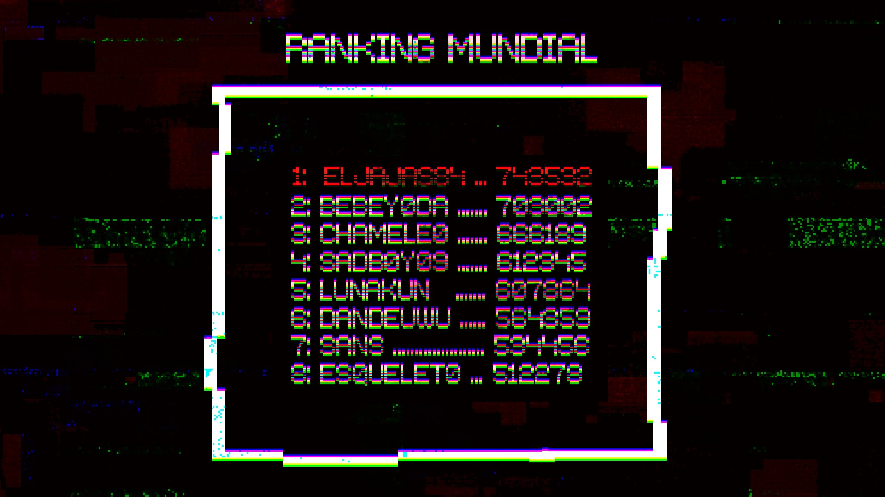

## HOSTING
El hosting del proyecto se hará en <b>*Git*</b>, del que podrán nutrirse *Facebook* e *itch.io*
  

# 4. CONTACTO
## MAIL, PLATAFORMAS INDIES Y REDES SOCIALES
+ Facebook: Rodillo´s Gaming 
facebook.com/rodillos.gaming.9

+ Twitter: @RodillosGaming 
twitter.com/RodillosGaming

+ itch.io: Rodillos Gaming 
rodillos-gaming.itch.io/

+ Youtube: Rodillos Gaming 
youtube.com/channel/UCUaR00AHGi0U2Z7mT9jfVfw

+ email: rodillosgaming@gmail.com
 

<b>¡GRACIAS POR JUGAR! :)</b>
